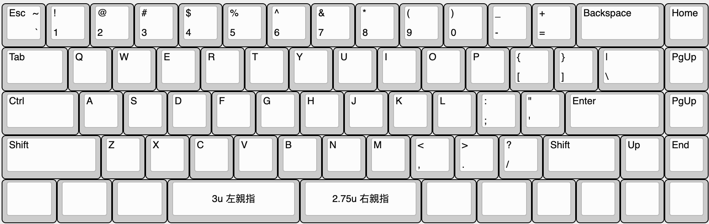

# TC69 静電容量親指シフト 65% キーボード

## 特徴

オープンソースの親指シフトキーボードです。

* 静電容量式
* QMK対応
* JLCPCBで作成したPCB
* 3Dプリントしたケース

## キーボード配列

* ANSI配列ベース
* 矢印キーあり
* 対応する親指シフトファームウェア [tc69 firmware](https://github.com/sadaoikebe/qmk_firmware/tree/capacitive)
* 親指シフト対応、親指キーB下割れ
* 親指キーに3u/2.75uのキーキャップを使用

<!--
["Esc\n\n~\n`","!\n1","@\n2","#\n3","$\n4","%\n5","^\n6","&\n7","*\n8","(\n9",")\n0","_\n-","+\n=",{w:2},"Backspace","Home"],
[{w:1.5},"Tab","Q","W","E","R","T","Y","U","I","O","P","{\n[","}\n]",{w:1.5},"|\n\\","PgUp"],
[{w:1.75},"Ctrl","A","S","D","F","G","H","J","K","L",":\n;","\"\n'",{w:2.25},"Enter","PgUp"],
[{w:2.25},"Shift","Z","X","C","V","B","N","M","<\n,",">\n.","?\n/",{w:1.75},"Shift","Up","End"],
[{a:7,w:1.25},"",{w:1.25},"",{w:1.25},"",{w:3},"3u 左親指",{w:2.75},"2.75u 右親指",{w:1.25},"",{w:1.25},"","","","",""],
-->

静電容量キーボードなので配列は固定で変えられません

# BOM

Item |ソース | 数量 |  備考
:--- | :--- | :--- | :---
TC69 PCBA | [JLCPCB PCBA](pcb/) | 1 |
オペアンプ AD8601ARTZ | AliEx/淘宝等 | 1 |
アナログMUX 74AHC1G04 | AliEx/淘宝等 | 1 |
ケース | [3D Printed](case/) | 1 | 
定位板 | [Laser Cut Brass](plate/) | 1 | t=1.5mm アクリルでも良いが割れやすい
ヒートセット M3x6mmx4.6mm | [AliEx/淘宝等](https://www.aliexpress.com/item/1005002288716120.html) | 8 | 長さは6mmでなくても良い
M3 円頭六角ボルト 6mm | | 8 |  
M2 低頭精密小ねじ M2*8mm FX-0280EB | [Wilco](https://wilco.jp/products/F/FX-EB.html#page3) | 12 |
クッション 2mm厚 x 60mm x 4mm | | 16 | Poron/EVAフォーム等
Seeed Xiao RP2040 | [Seeed Studio](https://www.seeedstudio.com/XIAO-RP2040-v1-0-p-5026.html) | 1 | 
NiZ プランジャーキット | [NiZ](https://www.nizkeyboard.com/products/2019-new-niz-ec-switch) | 1セット |
コニカルスプリング | [淘宝](https://item.taobao.com/item.htm?spm=a1z0d.6639537/tb.1997196601.4.194d74840XCdqh&id=616137021034) | 69 |
シリコンドーム | [NiZ](https://www.nizkeyboard.com/products/ec-silicone-domes-35g-45g-55g) | 1セット |
2u スタビライザー | AliEx/淘宝/自キ専門店等 | 5 | Plate Mount
3u スタビライザー | AliEx/淘宝/自キ専門店等 | 1 | Plate Mount
キーキャップ | AliEx/淘宝/自キ専門店等 | 1セット | 3u/2.75uの親指キーが必要

## 組み立て工程

1. 定位板はあらかじめM2タップを切る
2. PCBにXiao RP2040, オペアンプ, MUX を取り付け
3. コニカルスプリングを並べてラバードームを乗せる
4. 定位板にハウジングを取り付け、プランジャーを通す
5. 定位板とPCBをM2*8ボルトで緊結する
6. PCBにクッションを貼る
7. ファームウェア書き込み
8. ケースに入れて完成

